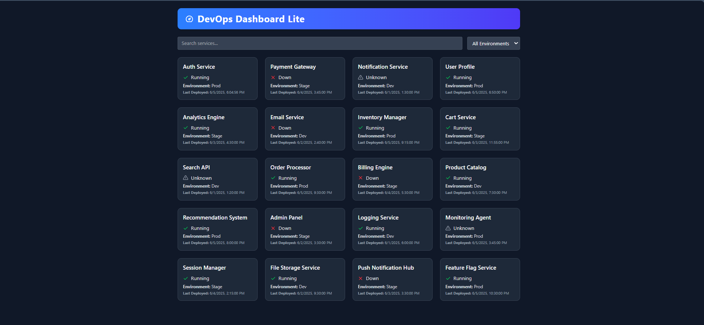

ByteList Task
=======
=======
>>>>>>> 9fae0ea (updated readme.md)
# 🚀 DevOps Dashboard Lite

A sleek and responsive dashboard to monitor services across environments. Built with **React**, **TypeScript**, **Tailwind CSS**, and **Tabler Icons**.

---

## 📸 Preview



---

## 🌟 Features

- ✅ Filter services by name or environment (`Dev`, `Stage`, `Prod`)
- 🎯 Status indicators with icons (`Running`, `Down`, `Unknown`)

- ⚡ Smooth animations & responsive grid layout
- 🧩 Built using Vite + React + Tailwind

---

## 🛠️ Tech Stack

- React + TypeScript
- Tailwind CSS
- Vite
- Tabler Icons

---

## 📦 Installation

```bash
# 1. Clone the repo
git clone https://github.com/i-ayushh18/ByteListTask.git

# 2. Install dependencies
npm install

# 3. Run locally
npm run dev
<<<<<<< HEAD
>>>>>>> 9fae0ea (updated readme.md)
=======
>>>>>>> 9fae0ea (updated readme.md)
